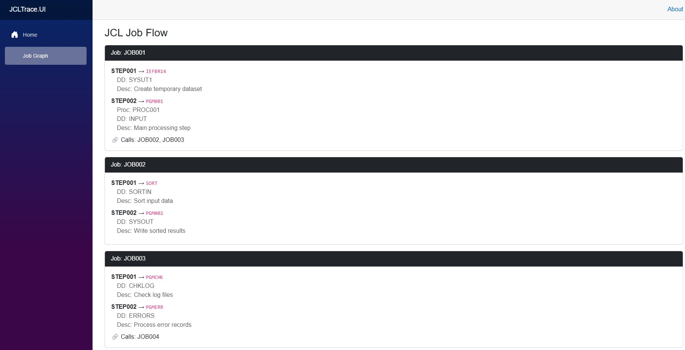

# JCLTrace

**JCLTrace** is a modernization-focused engineering tool that parses and visualizes **legacy JCL job flows** in a clean, structured interface. Built with **Go** and **Blazor Server**, it helps developers, architects, and modernization teams **map and trace complex batch job chains** typically found in mainframe systems.

---

## 🔍 What It Does

- Parses JCL files and PROC references
- Identifies `JOB`, `EXEC`, `PROC`, `DD` steps
- Detects job-to-job calls via `SUBMIT`, `SYSTSIN`, and chained EXECs
- Visualizes job execution flows in a professional, interactive Blazor UI
- Designed for real-world legacy modernization, not just educational use

---

## 🧰 Tech Stack

| Component       | Description                                             |
|----------------|---------------------------------------------------------|
| **Go (CLI)**    | Parses `.jcl` and `.proc` files, outputs structured JSON |
| **Blazor Server** | Web UI that loads and visualizes parsed job flows        |
| **Bootstrap**   | Provides a clean, responsive UI layout                  |
| **JSON (Bridge Format)** | Acts as the interface between the CLI parser and UI |

---

## 📸 Current Preview

> 📌 Phase 1: Working UI with mock JSON load



---

## 🚀 How to Run

1. **Clone the repository**
   ```bash
   git clone https://github.com/YOUR-USERNAME/JCLTrace.git
   ```

2. **Navigate to the UI project**
   ```bash
   cd JCLTrace/ui-blazor
   ```

3. **Run the Blazor Server app**
   ```bash
   dotnet run
   ```

4. **Open your browser**
   ```
   http://localhost:5000/graph
   ```

---

## 📂 Folder Structure

```
JCLTrace/
├── cli-engine/            → Go CLI parser (WIP)
│   ├── main.go
│   ├── parser/
│   ├── utils/
│   └── config/
│       └── patterns.yml
│
├── ui-blazor/             → Blazor Server UI
│   ├── Pages/
│   ├── Models/
│   ├── Services/
│   └── wwwroot/
│       └── mock/
│           └── job_map.json
│
├── jcl-files/             → Sample JCL and PROC files
│   └── procs/
│
├── parsed-output/         → Generated CLI output (loaded by UI)
├── integration/           → Scripts and launchers
│   └── launcher.ps1
└── README.md
```

---

## 🎯 Use Cases

JCLTrace is built for:

- 🏛 Government & banking modernization teams
- 🧠 Engineers inheriting legacy COBOL/JCL systems
- 🛠 DevOps needing batch flow documentation
- 🔄 Teams preparing for refactor, wrapper layers, or API exposure

---

## 🛣 Roadmap

- [x] Build mock-driven UI for job/step visualization
- [ ] Integrate Go CLI parser for live file analysis
- [ ] Add job-chain tracing logic
- [ ] Enable file/folder upload support
- [ ] Export job maps as PNG/SVG/Markdown
- [ ] Add modernization strategy tags (`wrap`, `replace`, `retain`)
- [ ] Highlight unresolved PROCs or broken chains

---

## 🤝 Contributions

Currently built as a focused solo tool. Contributions may open up once the CLI core and UI contract are stabilized.

---

## 👤 Author

**Mederick Bernier**  
Modernization Engineer – bridging legacy and modern systems  
[GitHub: @MederickBernier](https://github.com/MederickBernier)

---

## 📄 License

MIT License

> You are free to use, modify, and adapt this tool.  
> Please don’t close-source a copy and sell it back.